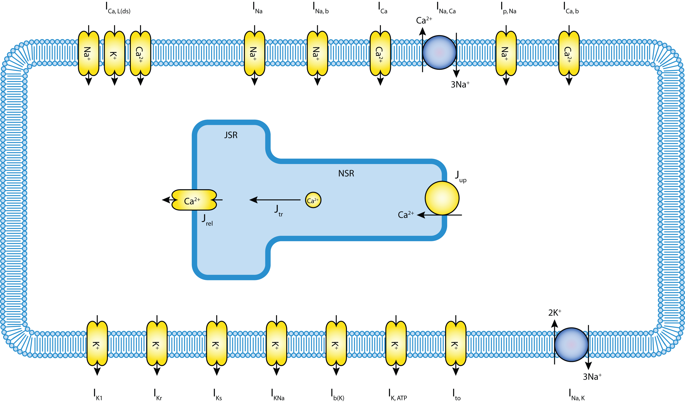
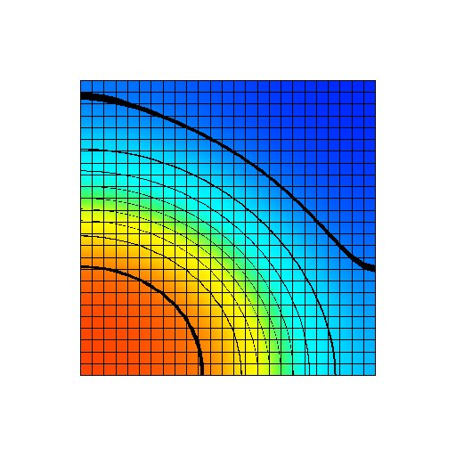
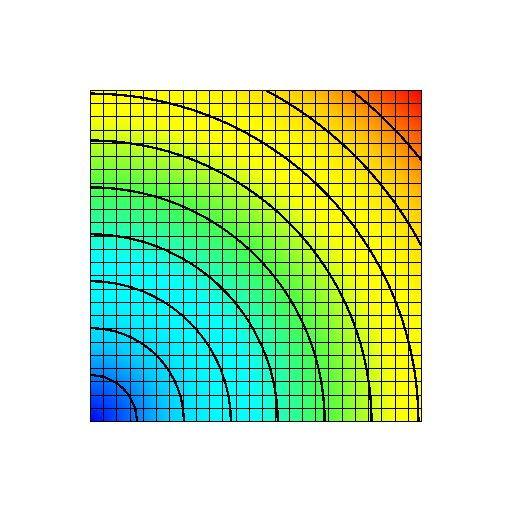
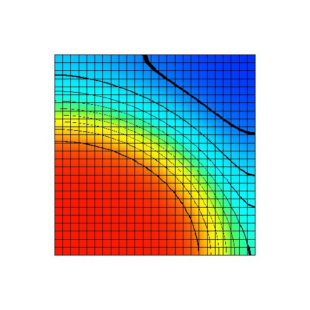

.. _examples-bioelectrics-Monodomain:

Monodomain on a 2D domain with Noble 98 cellular model
------------------------------------------------------

.. sectionauthor:: Chris Bradley (c.bradley@auckland.ac.nz)

This example demonstrates a monodomain solution in a 2D domain using a Noble 98 cellular model. The Noble 98 model is used via `CellML <http://cellml.org>`_.

This is a Python example. In order to exectute this example, you will need to have the OpenCMISS Python bindings available. This :download:`Cmgui command file <visualise.com>` can be used to visualise the simulation output.

The example is encoded in :download:`Monodomain2DSquare.py`. Below we describe some of the key aspects of this example.

.. contents::

Example description
+++++++++++++++++++

This example starts, like all python examples with importing modules. In addition to sys, os and the CMISS module, math is imported as we will be using the math.sqrt function later on.

.. literalinclude:: Monodomain2DSquare.py
   :language: python
   :linenos:
   :start-after: #DOC-START imports
   :end-before: #DOC-END imports

The exact setup of the problem is controlled by a number of parameters in the python script, as shown below. The example solves the monodomain equations on a 2D domain of dimensions width by height. It is discretised with bilinear Lagrange finite elements with numberOfXElements in the X direction and numberOfYElements in the Y direction. The material parameters for the domain are controlled with the Am parameter for the cell membrane area, Cm for the membrane capacitance and conductivity for continuum conducticity. To start the simulation a stimulation is applied to the left half of the bottom row of nodes. This stimulation lasts from time zero until time stimStop. The magnitude of the stimulus is given by stimValue parameter. After time stimStop the stimulation is turned of and the simulation is continued until time timeStop. The time step for the spatial PDE problem is given by the pdeTimeStep parameter and the time step for the ODE integration is given by the odeTimeStep parameter. The final parameter, outputFrequency, controls how many time steps pass before the solution is output to file.

.. literalinclude:: Monodomain2DSquare.py
   :language: python
   :linenos:
   :start-after: #DOC-START parameters
   :end-before: #DOC-END parameters

This example is designed to by run in parallel using MPI. OpenCMISS provides access to useful information about the parallel runtime environment via the calls below. numberOfComputationalNodes gives the total number of computational nodes the example is being run on. These nodes are numbered from 0 to (numberOfComputationalNodes - 1). computationalNodeNumber gives the node number that this particular process  is running on.

.. literalinclude:: Monodomain2DSquare.py
   :language: python
   :linenos:
   :start-after: #DOC-START parallel information
   :end-before: #DOC-END parallel information

The first step in our example will be to initialise OpenCMISS an to set up a region and coordinate system for our 2D mesh. This is achieved with the following calls

.. literalinclude:: Monodomain2DSquare.py
   :language: python
   :linenos:
   :start-after: #DOC-START initialisation
   :end-before: #DOC-END initialisation

In this example we will use the generated mesh capabilities of OpenCMISS to generate our 2D mesh. The first thing we need to do is create a basis function for the mesh. We will define a bilinear Lagrange basis.

.. literalinclude:: Monodomain2DSquare.py
   :language: python
   :linenos:
   :start-after: #DOC-START basis
   :end-before: #DOC-END basis

We can now create a generated mesh. We will create a regular mesh of size width x height and divide the mesh into numberOfXElements in the X direction and numberOfYElements in the Y direction. Note that when we finish generating the mesh we have a mesh object returned to us. This mesh object is just the same as if we had manually created the regular mesh.

.. literalinclude:: Monodomain2DSquare.py
   :language: python
   :linenos:
   :start-after: #DOC-START generated mesh
   :end-before: #DOC-END generated mesh

Once the mesh has been created we can decompose it into a number of domains in order to allow for parallelism. We choose the options to let OpenCMISS calculate the best way to break up the mesh. We also set the number of domains to be equal to the number of computational nodes this example is running on.

.. literalinclude:: Monodomain2DSquare.py
   :language: python
   :linenos:
   :start-after: #DOC-START decomposition
   :end-before: #DOC-END decomposition

Now that the mesh has been decomposed we are in a position to create fields. The first field we need to create is the geometry field. Here we create a field and set the field's mesh decomposition to the decomposed mesh that we have just created. We can choose exact how each component of the field is interpolated by setting component mesh component to be the mesh components that we created for the mesh. For this example we only have one mesh component. Once we have finished creating the field we can change the field DOFs to give us our geometry. Since this mesh has been generated we can use the generated mesh object to calculate the geometric parameters of the regular mesh.

.. literalinclude:: Monodomain2DSquare.py
   :language: python
   :linenos:
   :start-after: #DOC-START geometry
   :end-before: #DOC-END geometry

We are now in a position to define the type of physics that we wish to solve. This is done by creating an equations set which is a contianer object for all the parameters we need to describe the physics. Here we create an bioelectrics class equation of type monodomain.

.. literalinclude:: Monodomain2DSquare.py
   :language: python
   :linenos:
   :start-after: #DOC-START equations set
   :end-before: #DOC-END equations set

Next we create the fields for the equations set. For the monodomain equation we need a dependent field (our solution) and a materials field (to descibe the physical material constant. Here we do not define a field before the create starts and so we let OpenCMISS create an appropriate dependent and materials field for the monodomain equations being described. Once the fields have been created we can set the field DOF values. In this example the domain is isotropic and so we set the four components of the materials field to be the Am, Cm and conductivity that we defined in the parameters section.

.. literalinclude:: Monodomain2DSquare.py
   :language: python
   :linenos:
   :start-after: #DOC-START equations set fields
   :end-before: #DOC-END equations set fields

CellML
******

As mentioned above, this example uses the Noble 98 guinea-pig electrophysiology model defined in CellML. The guinea-pig ventricular cell model, originally developed by Noble et al in 1991, has been greatly extended to include accumulation and depletion of calcium in a diadic space between the sarcolemma and the sarcoplasmic reticulum where, according to contempory understanding, the majority of calcium-induced calcium release is triggered. A schematic of the model is shown below

   
   **Figure:** Schematic of the Noble 98 guinea-pig ventricular cell model.

In this section we briefly describe how a CellML cellular model is used for a monodomain simulation. Further details and general description can be found in the :ref:`examples-cellml`. First the :term:`CellML environment` must be created and our Nobel 98 model imported into the environment:

.. literalinclude:: Monodomain2DSquare.py
   :language: python
   :linenos:
   :start-after: #DOC-START create cellml environment 
   :end-before: #DOC-END create cellml environment

With the CellML model imported, we are now able to flag the variables from the model that are :term:`known` (by the monodomain pde model) and those variables that are :term:`wanted` (by the monodomain pde model) from the CellML model. These are the variables from the CellML model that we will want to associate with fields in the OpenCMISS (pde continuum) model.

.. literalinclude:: Monodomain2DSquare.py
   :language: python
   :linenos:
   :start-after: #DOC-START flag variables 
   :end-before: #DOC-END flag variables

The transmembrane voltage is a variable that is used by both the continuum pde model and the CellML model. The variable is thus mapped as both known and wanted. This means that the continuum value of V is copied to the CellML model before evaluation and the CellML value of V is copied from the CellML model to the continuum pde model once the CellML model has finished being integrated. The other variables that we required to be flagged are the stimulus current and the transmembrane currents. The stimulus current is flagged as known as it will be controled by the pde model. The 

Having flagged the variables we require from the CellML model, we can map them to fields, more specifically, the components of field variables. We map the transmembrane voltage to variables in the CellML model. Here Vm is needs to be passed from the OpenCMISS fields to the CellML fields before the CellML model is evaluated and then passed out from CellML to OpenCMISS after it is evaluated.

.. literalinclude:: Monodomain2DSquare.py
   :language: python
   :linenos:
   :start-after: #DOC-START map Vm components 
   :end-before: #DOC-END map Vm components

Note that we have initialised the OpenCMISS field for the transmembrane voltage to be the resting transmembrane voltage. We have set the wanted flag on the transmembrane current variables in the CellML model. These variables will be stored in the intermediates field that we create below. As these variables do not affect any other OpenCMISS field we do not need to map them.

We now need to create the CellML fields. We do this by creating the models field

.. literalinclude:: Monodomain2DSquare.py
   :language: python
   :linenos:
   :start-after: #DOC-START define CellML models field
   :end-before: #DOC-END define CellML models field

the state field

.. literalinclude:: Monodomain2DSquare.py
   :language: python
   :linenos:
   :start-after: #DOC-START define CellML state field
   :end-before: #DOC-END define CellML state field

and the parameters and intermediates field

.. literalinclude:: Monodomain2DSquare.py
   :language: python
   :linenos:
   :start-after: #DOC-START define CellML parameters and intermediate field
   :end-before: #DOC-END define CellML parameters and intermediate field

Results
+++++++

.. figure:: doc/start.png
   :align: center
   :width: 40%
   :figwidth: 80%
   
   **Figure:** Transmembrane voltage field immediately after the start of the simulation. A stimulus current has been applied to the first half of the bottom row of nodes.

   
   **Figure:** Transmembrane voltage field after a fixed period of the simulation with a uniform gNa distribution at its normal value. The transmembrane voltage varies from -95 mV (blue) to +50 mV (red).

   
   **Figure:** Plot of gNa with a radial variation. gNa varies from its normal value of 3.855 x 10^-5 mS mm^-2 at the bottom left node (blue) to 300% of its normal value at the top right node (red).

   
   **Figure:** Transmembrane voltage field after a fixed period of the simulation with a radial gNa distribution from 100 to 300 % of its normal value (shown above). The transmembrane voltage varies from -95 mV (blue) to +50 mV (red).

