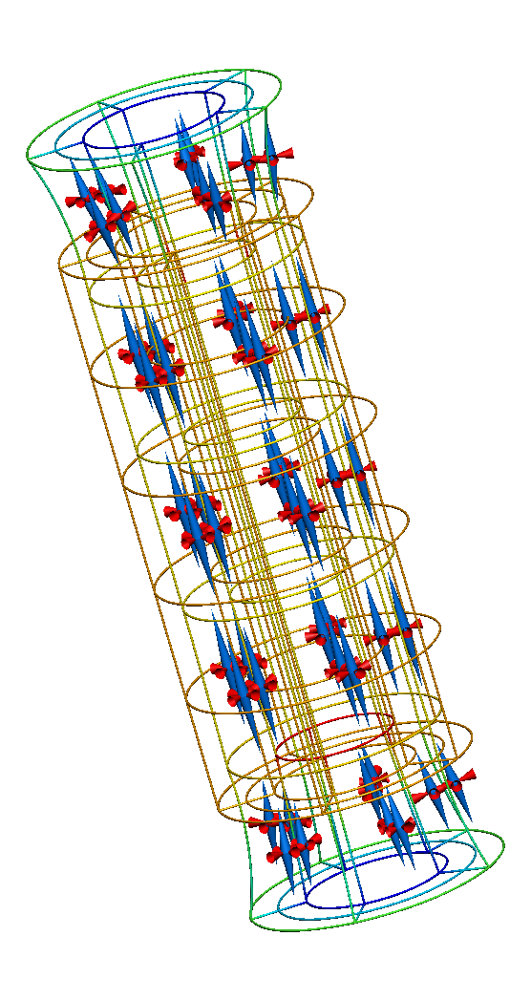

.. _examples-finiteElasticity-HomogeneousPipeAxialExtension:

Axial extension in a homogeneous pipe
-------------------------------------

.. sectionauthor:: Jagir Hussan <https://unidirectory.auckland.ac.nz/profile/rjag008>, 
                   David Nickerson <http://about.me/david.nickerson/>

This example demonstrates the application of an mechanical extension to a homogeneous tissue cylinder model along the axis of the cylinder. The Mooney-Rivlin constitutive law is used via `CellML <http://cellml.org>`_.

This is a Python example. In order to exectute this example, you will need to have the OpenCMISS Python bindings available. This :download:`Cmgui command file <viewAxialStretchResults.com>` can be used to visualise the simulation output. The geometric finite element mesh used in this example was created using PyZinc with the script :download:`quadcylinderthreematerials.py`.

The example is encoded in :download:`HomogeneousPipeAxialExtension.py`. Below we describe some of the key aspects of this example.

.. contents::

Example description
+++++++++++++++++++

In this example the The Python script :download:`exfile.py` is used to load the geometry from a file in the Zinc `EX format <http://www.cmiss.org/cmgui/wiki/TheCmguiEXFormatGuideExnodeAndExelemFiles>`_.

.. literalinclude:: HomogeneousPipeAxialExtension.py
   :language: python
   :linenos:
   :start-after: #DOC-START imports
   :end-before: #DOC-END imports

The :file:`exfile.py` script in needs to be in the current folder or available in your Python environment for the ``import`` on line 1 to succeed. Whereas on line 3 we are specifically adding the location we expect to find the OpenCMISS Python bindings using the :envvar:`OPENCMISS_ROOT` environment variable. Using the ``exfile`` module we are able to load the finite element model geometry from the ``EXREGION`` file: :download:`hetrogenouscylinder.exregion`, as shown below:

.. literalinclude:: HomogeneousPipeAxialExtension.py
   :language: python
   :linenos:
   :start-after: #DOC-START load exfile
   :end-before: #DOC-END load exfile

Throughout the remainder of the Python script you can see the data from the now defined ``exregion`` object used to create the geometric mesh via the standard OpenCMISS methods. For example, in this code:

.. literalinclude:: HomogeneousPipeAxialExtension.py
   :language: python
   :linenos:
   :start-after: # DOC-START define node coordinates
   :end-before: # DOC-END define node coordinates
   
we set the nodal coordinates and derivatives in the models geometric field. There is also code to keep track of nodes located at either end of the vessel, which will be used later when defining boundary conditions.

CellML
******

As mentioned above, this example uses the Mooney-Rivlin mechanical constitutive law defined in CellML. In this section we briefly describe how this is achieved, further details and general description can be found in the :ref:`examples-cellml`. First the :term:`CellML environment` must be created and our Mooney-Rivlin model imported into the environment:

.. literalinclude:: HomogeneousPipeAxialExtension.py
   :language: python
   :linenos:
   :start-after: #DOC-START create cellml environment 
   :end-before: #DOC-END create cellml environment

With the CellML model imported, we are now able to flag the variables from the model that are :term:`known` (by the finite elasticity model) and those variables that are :term:`wanted` (by the finite elasticity model) from the CellML model. These are the variables from the CellML model that we will want to associate with fields in the OpenCMISS (continuum) model.

.. literalinclude:: HomogeneousPipeAxialExtension.py
   :language: python
   :linenos:
   :start-after: #DOC-START flag variables 
   :end-before: #DOC-END flag variables

Having flagged the variables we require from the CellML model, we can map them to fields, more specifically, the components of field variables. First we map the strain tensor from the finite elasticity model to variables in the CellML model:

.. literalinclude:: HomogeneousPipeAxialExtension.py
   :language: python
   :linenos:
   :start-after: #DOC-START map strain components 
   :end-before: #DOC-END map strain components

In the CellML model, each component of the strain tensor has a variable: ``equations/E11``, ``equations/E12``, etc.; following the :term:`CellML variable name` convention. In the finite elasticity model, the strain tensor is found in the dependent field as the ``U1`` field variable. These mappings are defined using the :py:meth:`CellML.CreateFieldToCellMLMap` method as the value of these variables in the CellML model is *known* in the finite elasticity model and will be set by OpenCMISS when evaluating the CellML model.

In a similar manner we define equivalent mappings for the stress tensor (the ``U2`` field variable in the dependent field):
 
.. literalinclude:: HomogeneousPipeAxialExtension.py
   :language: python
   :linenos:
   :start-after: #DOC-START map stress components 
   :end-before: #DOC-END map stress components

In this case we use the :py:meth:`CellML.CreateCellMLToFieldMap` method as it is the CellML model which defines the calculation of stress for a given strain state (i.e., the stress tensor components are *wanted* variables from the CellML model). Defining these field mappings informs OpenCMISS that when the CellML model is evaluated *known* variables should have their values updated to the current state of the corresponding field variable components and following an evaluation the field variable components mapped to *wanted* variables should be updated to reflect the newly computed value of the variables in the CellML model.

Now that we have imported the CellML model that we wish to use in our simulation and appropriately flagged the relevant variables, we can finish the creation of our :term:`CellML environment`:

.. literalinclude:: HomogeneousPipeAxialExtension.py
   :language: python
   :linenos:
   :start-after: #DOC-START create cellml finish 
   :end-before: #DOC-END create cellml finish

Finishing the CellML environment creation will now trigger the OpenCMISS to instantiate the CellML model(s) in that environment as executable code. No further changes to that code are possible.

We now need to define the :term:`CellML models field` for our finite elasticity model. First (lines 2-4 below) we create a default OpenCMISS field and set it as the CellML environment's models field. We then iterate over all elements in our finite element model and set each Gauss point in all elements to be associated with the Mooney-Rivlin model we imported into our CellML environment above.

.. literalinclude:: HomogeneousPipeAxialExtension.py
   :language: python
   :linenos:
   :start-after: #DOC-START define CellML models field
   :end-before: #DOC-END define CellML models field
   
The :term:`CellML parameters field` and :term:`CellML intermediate field` are simply created with standard default OpenCMISS fields, as shown below.

.. literalinclude:: HomogeneousPipeAxialExtension.py
   :language: python
   :linenos:
   :start-after: #DOC-START define CellML parameters and intermediate fields
   :end-before: #DOC-END define CellML parameters and intermediate fields

The CellML environment is now set-up and ready to use with the single Mooney-Rivlin model that we have imported. When defining the finite elasticity problem in OpenCMISS it is important that the CellML subtype is specified to ensure that the CellML constitutive law is used:

.. literalinclude:: HomogeneousPipeAxialExtension.py
   :language: python
   :linenos:
   :start-after: #DOC-START define CellML finite elasticity problem
   :end-before: #DOC-END define CellML finite elasticity problem

And then we need to define the numerical solver to use for the CellML constitutive law that we are using:

.. literalinclude:: HomogeneousPipeAxialExtension.py
   :language: python
   :linenos:
   :start-after: #DOC-START define CellML solver
   :end-before: #DOC-END define CellML solver
   
In line 2 we create a new default solver and then initialise it as the CellML solver from the general non-linear solver that we are using for the finite elasticity model (line 4). Lines 5 and 6 show the creation of the CellML equations and initialising them from the CellML solver. Finally, in line 7 we add the :term:`CellML environment` containing our constitutive model to the CellML equations.

The CellML constitutive law is now defined as part of the general finite elasticity model and the simulation can be performed following assignment of the required boundary conditions, etc.

Results
+++++++

   
   **Figure:** Results from running this pipe extension simulation. The gold lines show the original, undeformed, cylinder geometry. The coloured lines show the deformed geometry, with the colour varying to show the difference in strain through the wall of the cylinder. The cones represent the three normalised principal strains at material points throughout the tissue volume (red for compression and blue for extension).