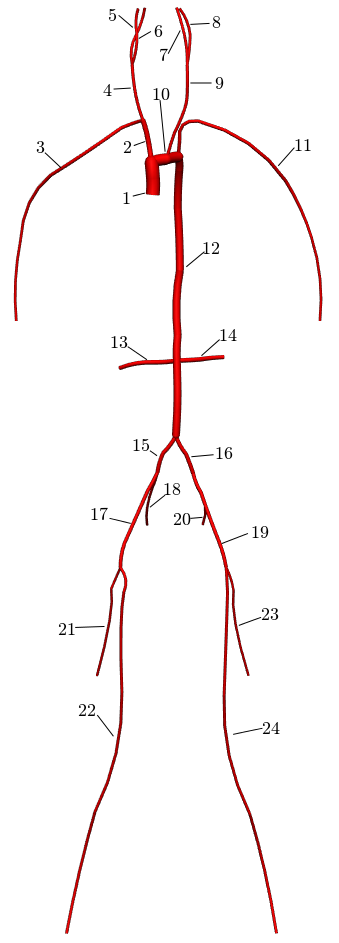
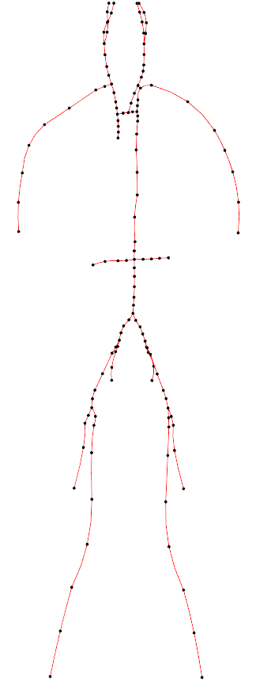
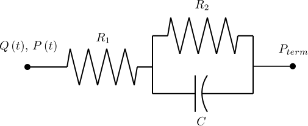
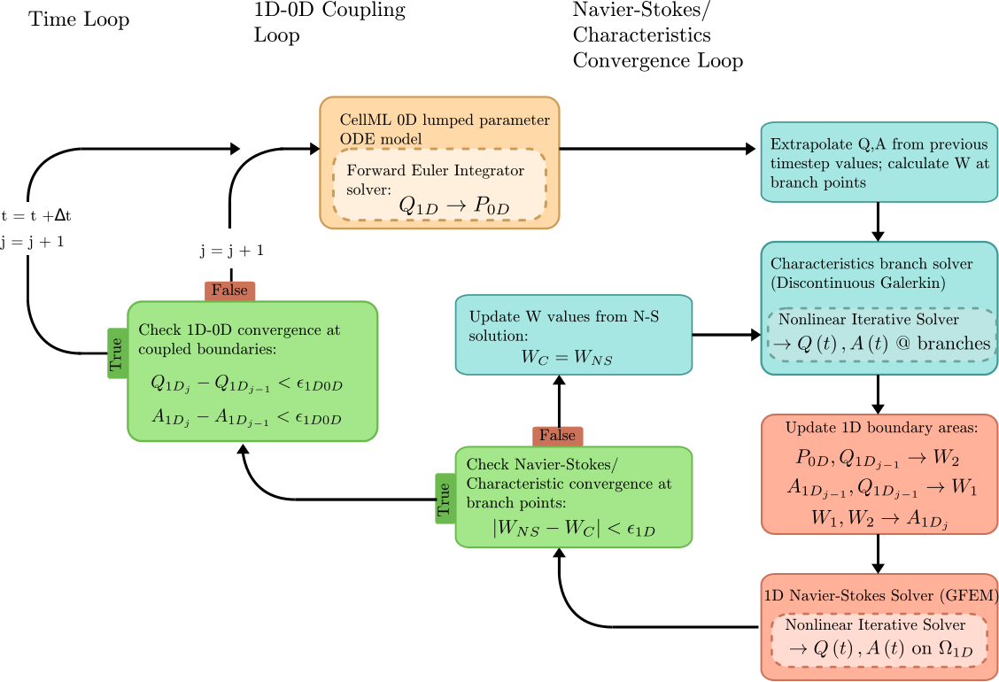
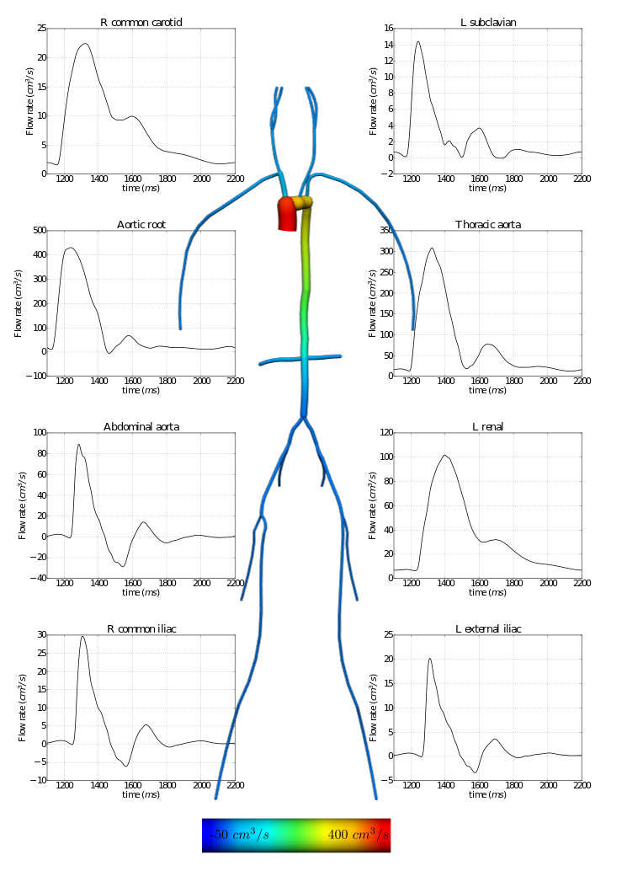
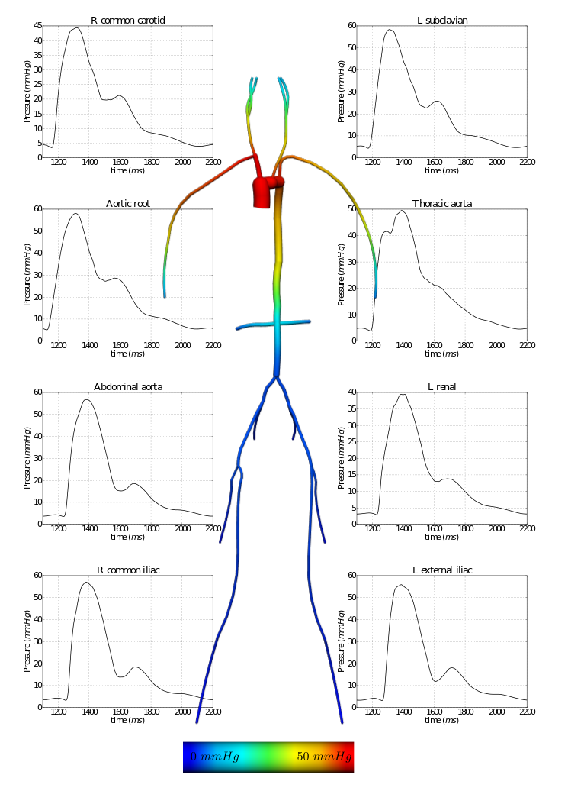

.. _examples-1D0DVisibleHuman:

===========================================================
Fluid Mechanics: Navier-Stokes: 1D-0D Visible Human Example
===========================================================

.. sectionauthor:: David Ladd

.. _OpenCMISS: http://www.opencmiss.org

Introduction
============

Computational models can be used to gain mechanical insight into blood flowing in vessels under healthy and pathophysiological states.
However, constructing full subject-specific CFD models of the entire arterial and/or venous vasculature is currently considered impractical, owing to: (1) the time and resources required to identify, segment, and constrain a model of the billions of vessels in a human body and (2) the computational cost such a model would incur.

As a result, the systemic context of a modeled system is often incorporated into definable models through boundary conditions and/or coupled models.
These multiscale models restrict higher dimensional (3D/1D) models to a region of interest and rely on simpler, lower dimensional (0D), models to approximate physical behaviour outside the higher-dimensional domain.
This involves coupling together of dependent fields (\ie pressure and velocity/flow), material fields (\eg fluid viscosity and wall compliance), and geometric fields (\eg vessel diameter) at the interfaces between 3D, 1D, and/or 0D model domains.

In the following example, a 1D network of 24 major arteries has been constructed from the male Visible Human dataset, as shown below.
The resulting mesh contains 135 nodes on 67 quadratic line elements, as shown below.

**Figure:** 1D arteries and mesh.

Simple 0D/lumped parameter RCR Windkessel models are coupled to the 1D model at the outlet boundaries.
These models use the fluid-electric analog to provide an basic approximation of resistance to flow due to perfusing vascular beds (the R1 and R2 components) and downstream vessel compliance (the C component).

   **Figure:** The 3-element RCR Windkessel model

Methods
=======

A flow waveform from published data is applied at the aortic root of the model and interpolated in time from tabulated data using cubic splines.
Outlet boundary conditions are provided by the 0D solution.

OpenCMISS/CellML field mapping capabilities allow for the coupling of the 1D (OpenCMISS) and 0D (CellML) solvers:

.. literalinclude:: 1DTransientExample.py
   :language: python
   :linenos:
   :start-after: # DOC-START cellml define field maps
   :end-before: # DOC-END cellml define field maps

**Snippet:** OpenCMISS/CellML field mappings

Flow rate (Q) from the 1D Navier-Stokes/Characteristic solver provides the forcing term for the 0D ODE circuit solver.
Pressure (P) is returned from the CellML solver to provide constraints on the Riemann invariants of the 1D system, which translate to area boundary conditions for the 1D FEM solver.
At each timestep, the 1D and 0D systems are iteratively coupled until the boundary values converge within a user-specified tolerance at the 1D-0D interfaces.
This procedure is outlined in the figure below.

   **Figure:** Overview of the coupled 1D-0D solution process.

Results
=======

   **Figure:** Flow rates from the 1D-0D solution. Vessels shown at peak systole

   **Figure:** Pressure from the 1D-0D solution. Vessels shown at peak systole
