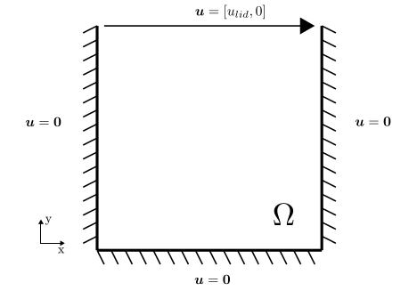
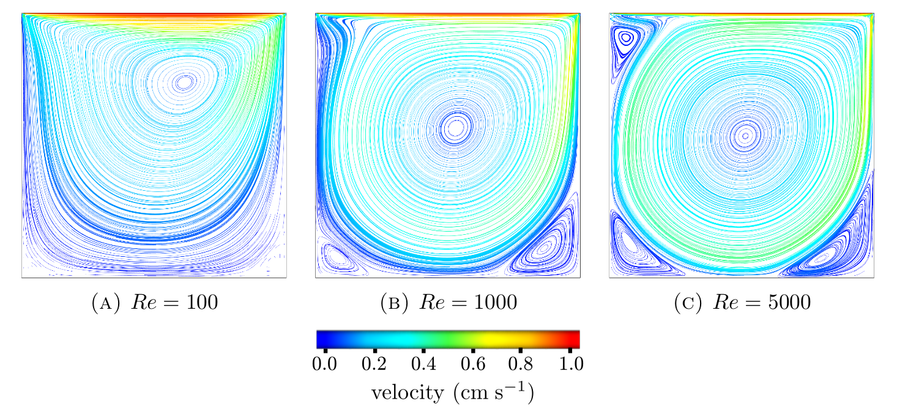
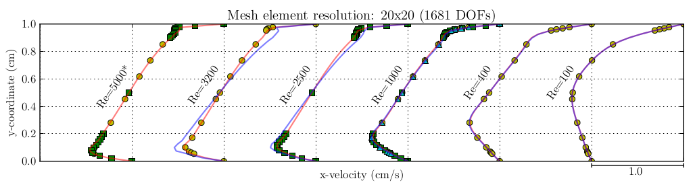
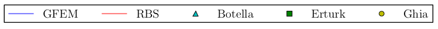

.. _examples-LidDrivenCavity:

===========================================================
Fluid Mechanics: Navier-Stokes: Lid-Driven Cavity Example
===========================================================

.. sectionauthor:: David Ladd

.. _OpenCMISS: http://www.opencmiss.org

Introduction
============

The 2D square lid-driven cavity (LDC) problem is a popular test case in numerical fluid mechanics as it is simple to execute but results in complex vortex features at higher Reynolds numbers.
Several studies for the LDC and its derivatives are available, both numerical (e.g., [Ghia]_, [Botella]_, [Erturk]_) and theoretical (e.g., [Shankar]_) that provide a basis for validation.

This example is used to test the Navier-Stokes routines using classic Galerkin finite element methods and/or stabilised methods.
The residual-based stabilisation method tested here incorporates *subgrid/fine* scale physics into *finite element level/coarse* scale problems using a variational multiscale method (see [Bazilevs]_).

To run this example under different parameters, edit the problem control parameter section shown in the snippet below. 
By default, the problem solves using GFEM and RBS at a Reynolds number of 2500 on a 20x20 element mesh using Q2-Q1 Taylor-Hood elements. 

.. literalinclude:: LidDriven.py
   :language: python
   :linenos:
   :start-after: # DOC-START Control Panel
   :end-before: # DOC-END Control Panel

**Snippet:** User-specifiable parameters

Methods
=======

   **Figure:** Boundary conditions for the square lid-driven cavity example

From a zeroed initial condition, the x-velocity at the top of the square cavity is increased to the specified lid velocity over the first 10 seconds.
No-slip conditions bound the sides and bottom of the cavity and a zero reference pressure value is specified in the bottom left corner.

Results
=======

   **Figure:** Seeded streamline plots for various Reynolds numbers using a 60x60 element mesh

   **Figure:** GFEM and residual-based-stabilised velocity profiles through the centerline of a 20x20 lid-driven cavity compared to published results from [Ghia]_, [Botella]_, and [Erturk]_. Note the GFEM solution diverges at Re=5000

[Bazilevs] Y. Bazilevs, V. M. Calo, J. A. Cottrell, T. J. R. Hughes, A. Reali, and G. Scovazzi, “Variational multiscale residual-based turbulence modeling for large eddy simulation of incompressible flows,” Computer Methods in Applied Mechanics and Engineering, vol. 197, no. 1–4, pp. 173–201, Dec. 2007.

[Botella] O. BOTELLA and R. PEYRET, “BENCHMARK SPECTRAL RESULTS ON THE LID-DRIVEN CAVITY FLOW,” Computers & Fluids, vol. 27, no. 4, pp. 421–433, 1998.

[Erturk] E. Erturk, T. C. Corke, and C. Gökçöl, “Numerical solutions of 2-D steady incompressible driven cavity flow at high Reynolds numbers,” Int. J. Numer. Meth. Fluids, vol. 48, no. 7, pp. 747–774, Jul. 2005.

[Ghia] U. Ghia, K. . Ghia, and C. . Shin, “High-Re solutions for incompressible flow using the Navier-Stokes equations and a multigrid method,” Journal of Computational Physics, vol. 48, no. 3, pp. 387–411, Dec. 1982.

[Shankar] P. N. Shankar and M. D. Deshpande, “Fluid mechanics in the driven cavity,” Annual Review of Fluid Mechanics, vol. 32, no. 1, pp. 93–136, 2000.

